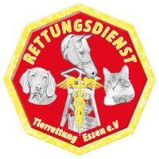

# Dokumentation zur Lösung der ESA 8: CSS für Fortgeschrittene
Realisation der Praxisaufgabe in Form des Demo-Projekts "Tierrettung Essen e. V."

Sebastian Pesch | &copy; 2022

## Inhalt

* [Basisinformationen](#basisinformationen)
* [Kleine Viewports](#kleine-viewports)
* [Mittlere Viewports](#kleine-viewports)
* [Große Viewports](#kleine-viewports)

---

## Basisinformationen

... input

## Kleine Viewports

... input

## Mittlere Viewports

...input

## Große Viewports